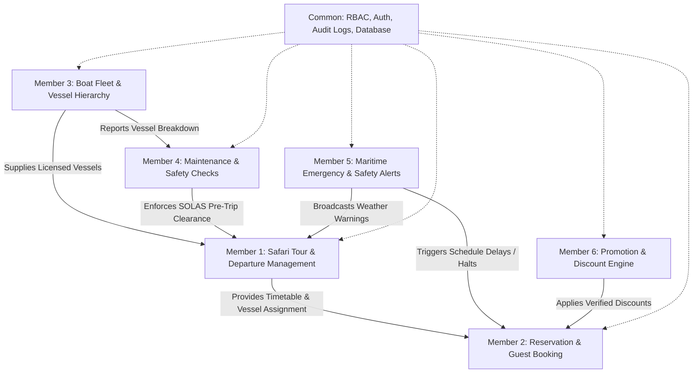
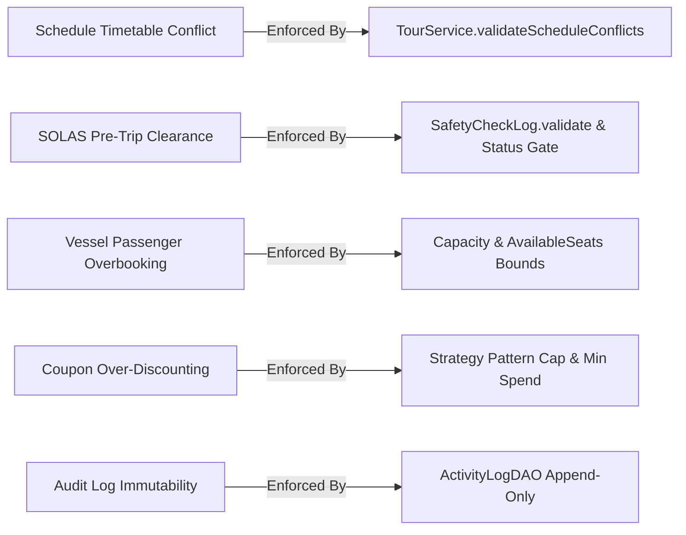

# Roles & Permissions Specification: What Member Roles Can & Cannot Do

**Sri Lanka Institute of Information Technology (SLIIT)**  
**Module:** SE2030 – Software Engineering (Year 2, Semester 1 - 2026)  
**Project Group:** Y2-S1-MLB-B8G1-09  
**System:** Web-Based Boat Safari Trip Management System  
**Industry Benchmark:** Inspired by [Sail Lanka Charter](https://www.sail-lanka-charter.com/)  

---

## 1. Document Purpose & Architectural Overview

In accordance with software engineering principles of **Separation of Concerns (SoC)**, **Principle of Least Privilege (PoLP)**, and **Role-Based Access Control (RBAC)**, this document defines the exact operational boundaries of:
1. **The 6 Group Member Subsystems (Functional Scopes & Boundaries):** What each member's module is responsible for, what actions it can execute, and what domain boundaries it is prohibited from crossing.
2. **The 6 System User / Actor Roles (Runtime Permissions):** What each authenticated user type (`ADMIN`, `OFFICER`, `GUIDE`, `CAPTAIN`, `OWNER`, `CUSTOMER`) is permitted and forbidden to do across the platform.

---

## 2. Functional Scope Breakdown: The 6 Group Member Subsystems

---

### Member 1: Safari Tour & Departure Schedule Management
*Role Title: Safari Tour Operations Manager*  
*Dedicated Directory:* [`member1/`](file:///d:/Downloads/New%20folder%20(3)/SE/SE_PROJECT/member1/)

#### What Member 1 CAN Do:
- **Create Safari Tours:** Define tour packages with title, description, coastal region, category (`Whale Watching`, `Sunset Sail`, `Daylight Cruise`, `Snorkeling Safari`, `Overnight Charter`), duration in hours, base pricing, and `specialInstructions` (e.g. clothing guidelines, sunscreen rules).
- **Map Nautical Routes & Waypoints:** Link start and destination coastal harbors (Mirissa, Galle, Trincomalee, Passikudah) with scenic waypoints and nautical mileage.
- **Schedule Departures:** Assign an available vessel, licensed boat captain, and tour guide to specific departure and return date/time windows.
- **Enforce Real-Time Timetable Conflict Detection:** Validate that the assigned boat, captain, and guide do not have overlapping active trips.
- **Update Tour Details & Timetables:** Modify tour pricing, descriptions, and schedule departure windows before customer bookings commence.
- **Cancel Departures:** Mark departures as `CANCELLED` with a recorded operational reason, releasing all assigned crew and vessels.

#### What Member 1 CANNOT Do:
- **Cannot Directly Modify Guest Manifests:** Cannot add, edit, or delete customer booking names or passenger NICs (strictly reserved for Member 2).
- **Cannot Alter Vessel Engineering Specifications:** Cannot change engine horsepower, cruising speed, or licensed cabin count (strictly reserved for Member 3).
- **Cannot Bypass SOLAS Pre-Trip Safety Clearance:** Cannot clear a boat for departure if Member 4 has not logged an "All Clear" inspection.
- **Cannot Broadcast Maritime Weather Advisories:** Cannot issue naval hazard broadcasts or emergency squall alerts (strictly reserved for Member 5).
- **Cannot Define Promo Discount Rules:** Cannot create coupon codes or modify pricing strategies (strictly reserved for Member 6).

---

### Member 2: Reservation & Guest Manifest Management
*Role Title: Reservation & Guest Booking Manager*  
*Dedicated Directory:* [`member2/`](file:///d:/Downloads/New%20folder%20(3)/SE/SE_PROJECT/member2/)

#### What Member 2 CAN Do:
- **Process 3-Step Luxury Bookings:** Guide guests through departure selection, passenger manifest intake, and payment confirmation.
- **Collect Passenger Manifests:** Enforce collection of maritime compliance details for every traveler: Full Name, NIC/Passport Number, Age, Gender, Nationality, and Emergency Contact Phone.
- **Lock & Deduct Vessel Seats:** Automatically decrement `availableSeats` on the departure timetable in real-time when a booking is confirmed.
- **Generate Luxury Boarding Vouchers:** Issue digital boarding passes with unique reference codes (`SLC-2026-XXXX`).
- **Modify Pre-Departure Booking Details:** Update guest special dietary/mobility requests, swap passengers on the manifest, or shift departure dates (subject to seat availability).
- **Cancel Bookings & Calculate Refunds:** Cancel reservations, restore seats back to the departure inventory, and record refund tracking status.

#### What Member 2 CANNOT Do:
- **Cannot Overbook Beyond Vessel Capacity:** System strictly blocks bookings exceeding `availableSeats` or licensed vessel limits.
- **Cannot Create or Alter Departure Times:** Cannot create new tour schedules or change sailing hours (strictly reserved for Member 1).
- **Cannot Change Vessel Operational Status:** Cannot put boats in or out of service (strictly reserved for Member 3).
- **Cannot Sign Off on Boat Safety Checks:** Cannot approve seaworthiness or certify fuel levels (strictly reserved for Member 4).
- **Cannot Arbitrarily Override Coupon Values:** Cannot apply unauthorized discounts without validation against Member 6's strategy rules.

---

### Member 3: Boat Fleet & Vessel Hierarchy Management
*Role Title: Boat Fleet & Vessel Manager*  
*Dedicated Directory:* [`member3/`](file:///d:/Downloads/New%20folder%20(3)/SE/SE_PROJECT/member3/)

#### What Member 3 CAN Do:
- **Register Fleet Vessels (Polymorphic Factory):** Add Catamarans, Motor Yachts, and SpeedBoats with registration numbers, guest capacities, cabin counts, engine models, and cruising speed in knots.
- **Catalog Marine Safety Equipment:** Record onboard life raft capacity, EPIRB beacon IDs, and VHF radio frequencies.
- **Control Vessel Operational Status:** Toggle status between `AVAILABLE`, `ASSIGNED`, `UNDER_MAINTENANCE`, and `INACTIVE`.
- **Enforce Fleet Maintenance Conflict Alerts:** When placing a vessel into maintenance, the system checks active scheduled departures and warns staff if active departures require vessel reassignment.
- **Update Vessel Engineering Specs:** Edit engine overhauls, cruising speed limits, and photo assets.
- **Decommission Vessels:** Remove retired or sold boats from active registry.

#### What Member 3 CANNOT Do:
- **Cannot Create Departure Timetables:** Cannot assign vessels to public calendar dates (strictly reserved for Member 1).
- **Cannot View or Alter Customer Financial Ledgers:** Cannot view personal customer credit card data or process booking refunds (strictly reserved for Member 2).
- **Cannot Sign Pre-Trip Departure Slips:** Vessel readiness for individual trips requires Member 4's captain inspection; Member 3 only manages fleet asset records.
- **Cannot Issue Severe Weather Alerts:** Cannot declare coastal navigation bans (strictly reserved for Member 5).
- **Cannot Create Loyalty Promo Codes:** Cannot configure discount coupons (strictly reserved for Member 6).

---

### Member 4: Maintenance Records & Pre-Trip Safety Checks
*Role Title: Boat Maintenance & Safety Compliance Manager*  
*Dedicated Directory:* [`member4/`](file:///d:/Downloads/New%20folder%20(3)/SE/SE_PROJECT/member4/)

#### What Member 4 CAN Do:
- **Enforce Mandatory 8-Point SOLAS Checklist:** Verify life jackets, life rafts, distress flares, fire extinguishers, VHF Channel 16 radio, bilge pumps, first aid kits, and engine coolant before every trip.
- **Validate Fuel Safety Threshold:** Strictly enforce fuel level $\ge 25\%$ (departure clearance is blocked if fuel is under 25%).
- **Log Pre-Trip Safety Checks:** Record weather observation notes, passenger safety briefing confirmation, and Captain digital signature.
- **Certify "Ready for Departure":** Formally update trip clearance status to `READY_FOR_DEPARTURE`.
- **Amend Safety Check Logs:** Allow inspecting captains to re-verify readings after corrective action (e.g. refueling or replacing equipment).
- **Log Dockyard Work Orders:** Track slipway repairs, spare parts costs, and marine technician notes.
- **Monitor Periodic Service Reminders:** Compute overdue service intervals for engine oil, impellers, and hull antifouling.
- **Void Invalid Inspection Logs:** Void erroneously submitted logs with mandatory explanation notes.

#### What Member 4 CANNOT Do:
- **Cannot Clear Departure with Incomplete Checklist:** System strictly blocks submission if any of the 8 SOLAS items are unchecked or fuel is $< 25\%$.
- **Cannot Alter Tour Route Boundaries:** Cannot modify nautical routes or destination harbor stops (strictly reserved for Member 1).
- **Cannot Modify Guest Manifests:** Cannot edit passenger lists or tickets (strictly reserved for Member 2).
- **Cannot Create New Boats in Fleet:** Cannot issue registration numbers or define hull architecture (strictly reserved for Member 3).
- **Cannot Broadcast Public Maritime Advisories:** Cannot trigger website-wide emergency ribbons (strictly reserved for Member 5).

---

### Member 5: Maritime Safety & Emergency Notice Management
*Role Title: Maritime Safety & Emergency Notice Manager*  
*Dedicated Directory:* [`member5/`](file:///d:/Downloads/New%20folder%20(3)/SE/SE_PROJECT/member5/)

#### What Member 5 CAN Do:
- **Broadcast Urgent Marine Advisories:** Issue live warnings across categories: `BAD_WEATHER`, `ROUGH_SEAS`, `NAVIGATIONAL_HAZARD`, `MECHANICAL_FAILURE`, `MEDICAL_EMERGENCY`, `TSUNAMI_WARNING`.
- **Set Severity Levels:** Classify advisories into `LOW` (Advisory), `MEDIUM` (Moderate Caution), `HIGH` (Danger), and `CRITICAL` (Immediate Threat).
- **Trigger Website Live Alert Ribbon:** Broadcast high-visibility pulsing banners across every public and staff page.
- **Publish Public JSON Feed API:** Expose live machine-readable feed at `/api/emergency/feed` for coast guard and mobile integration.
- **Escalate Active Alerts:** Modify active advisories in real-time (e.g. upgrading wind warnings to mandatory return-to-port orders).
- **Resolve & Archive Advisories:** Formally mark notices as `RESOLVED` with resolution timestamp, automatically dismissing banners.

#### What Member 5 CANNOT Do:
- **Cannot Cancel Bookings Automatically Without Staff Review:** Advisories inform staff and skippers; reservation officers must initiate customer refund communications.
- **Cannot Alter Tour Catalog Pricing:** Cannot discount tours due to bad weather (strictly reserved for Member 6).
- **Cannot Modify Vessel Hull Specs:** Cannot alter boat physical dimensions (strictly reserved for Member 3).
- **Cannot Falsify Pre-Trip Checklists:** Cannot sign off on pre-trip fuel or life jacket checks (strictly reserved for Member 4).
- **Cannot Delete Audit Logs:** All emergency broadcasts remain permanently in audit trail.

---

### Member 6: Promotion & Discount Strategy Management
*Role Title: Promotion & Discount Strategy Manager*  
*Dedicated Directory:* [`member6/`](file:///d:/Downloads/New%20folder%20(3)/SE/SE_PROJECT/member6/)

#### What Member 6 CAN Do:
- **Create Promotional Campaigns:** Configure promo codes (`WHALE20`, `EARLYBIRD`, `MONSOON25`) with start/end dates and redemption caps.
- **Enforce Strategy Pattern Calculations:**
  - *Percentage Strategy:* Deducts a percentage up to a maximum LKR discount cap.
  - *Fixed Amount Strategy:* Deducts a fixed LKR amount subject to a minimum spend.
  - *Seasonal/Monsoon Strategy:* Automatically applies off-peak promotional rates.
- **Validate Coupon Codes via AJAX API:** Expose real-time endpoint `/api/promotions/validate` returning discount amount, error reason, or savings.
- **Track Redemption Quotas:** Maintain ledger of customer redemptions against each promotion code.
- **Toggle Campaign Status:** Enable or disable campaigns instantly with 1-click controls.

#### What Member 6 CANNOT Do:
- **Cannot Generate Discounts Exceeding Total Fare:** Discount rules cannot reduce booking balances below zero.
- **Cannot Create Reservations or Bookings:** Promotional engine only validates and prices; actual bookings are executed by Member 2.
- **Cannot Reschedule Departures:** Cannot change sailing dates or times (strictly reserved for Member 1).
- **Cannot Authorize Vessel Maintenance Outlays:** Cannot approve repair bills (strictly reserved for Member 4).
- **Cannot Interfere with Safety Warnings:** Cannot override safety alerts with marketing promos (strictly reserved for Member 5).

---

## 3. Runtime User Role Permissions Matrix (RBAC)

The table below outlines what each authenticated user role can and cannot do in the live application:

| Functional Feature / Action | Admin | Reservation Officer | Tour Guide | Boat Captain | Boat Owner | Customer / Tourist |
|:---|:---:|:---:|:---:|:---:|:---:|:---:|
| **Browse Tours, Fleet, Schedules** | ✅ | ✅ | ✅ | ✅ | ✅ | ✅ |
| **Book Tour & Submit Manifest** | ✅ | ✅ | ❌ | ❌ | ❌ | ✅ |
| **View Own Bookings & Boarding Voucher** | ✅ | ✅ | ❌ | ❌ | ❌ | ✅ |
| **View All Customer Bookings** | ✅ | ✅ | ❌ | ❌ | ❌ | ❌ |
| **Modify Booking / Passenger Manifest** | ✅ | ✅ | ❌ | ❌ | ❌ | ❌ |
| **Cancel Booking & Release Seats** | ✅ | ✅ | ❌ | ❌ | ❌ | ✅ *(Own)* |
| **Create / Edit Safari Tours** | ✅ | ❌ | ❌ | ❌ | ❌ | ❌ |
| **Schedule Tour Departures** | ✅ | ❌ | ❌ | ❌ | ❌ | ❌ |
| **Register / Edit Fleet Vessels** | ✅ | ❌ | ❌ | ❌ | ❌ | ❌ |
| **Toggle Vessel Maintenance Status** | ✅ | ❌ | ❌ | ❌ | ❌ | ❌ |
| **Delete Decommissioned Vessel** | ✅ | ❌ | ❌ | ❌ | ❌ | ❌ |
| **Fill & Sign Pre-Trip Safety Check** | ✅ | ❌ | ❌ | ✅ | ❌ | ❌ |
| **Amend Existing Safety Check Log** | ✅ | ❌ | ❌ | ✅ *(Own)* | ❌ | ❌ |
| **Void Erroneous Safety Check Log** | ✅ | ❌ | ❌ | ❌ | ❌ | ❌ |
| **Record Dockyard Maintenance Repairs** | ✅ | ❌ | ❌ | ❌ | ❌ | ❌ |
| **Broadcast Maritime Emergency Notice**| ✅ | ✅ | ❌ | ✅ | ❌ | ❌ |
| **Resolve Active Emergency Alert** | ✅ | ✅ | ❌ | ❌ | ❌ | ❌ |
| **Create / Edit Promo Codes** | ✅ | ❌ | ❌ | ❌ | ❌ | ❌ |
| **Manage System User Accounts** | ✅ | ❌ | ❌ | ❌ | ❌ | ❌ |
| **View System Audit Activity Trail** | ✅ | ❌ | ❌ | ❌ | ❌ | ❌ |

---

## 4. User Role Persona Breakdown: Capabilities & Boundaries

### 1. System Administrator (`ADMIN`)
- **Primary Objective:** System health, master data, security, and cross-module governance.
- **Can Do:**
  - Create and configure tours, nautical routes, and destinations.
  - Schedule departure timetables and assign crew.
  - Manage user accounts, assign roles, and unlock credentials.
  - Decommission vessels and void erroneous safety inspection logs.
  - Access the master audit log and system activity trail.
- **Cannot Do:**
  - Cannot bypass automated schedule conflict checking (system rejects double-booked boats or captains even for Admins).
  - Cannot submit a pre-trip clearance checklist without a valid captain signature.
  - Cannot delete immutable audit activity logs.

---

### 2. Reservation Officer (`OFFICER`)
- **Primary Objective:** Front-desk booking, guest manifests, ticketing, and customer relations.
- **Can Do:**
  - Process telephone and walk-in reservations for any customer.
  - View master booking registers and search reservations by booking reference.
  - Update passenger manifest details and dietary/accessibility requests before sailing.
  - Reassign guests to alternative departures if available seats exist.
  - Issue official boarding vouchers.
  - Cancel bookings and initiate refund records.
  - Broadcast urgent weather advisories when notified by harbor authorities.
- **Cannot Do:**
  - Cannot create or modify tour base prices or route maps.
  - Cannot change boat technical specifications or delete vessels.
  - Cannot sign off on boat seaworthiness or pre-trip safety checks.
  - Cannot edit or delete other staff user accounts.

---

### 3. Boat Captain (`CAPTAIN`)
- **Primary Objective:** Open-sea navigation, passenger safety, and seaworthiness inspection.
- **Can Do:**
  - View assigned departure schedules, route waypoints, and passenger counts.
  - Conduct and electronically sign the mandatory 8-point SOLAS Pre-Trip Safety Check.
  - Certify fuel levels, sea state conditions, and passenger safety briefings.
  - Re-verify and amend safety check logs if refueling or equipment replacements occur.
  - Broadcast immediate maritime hazard alerts (e.g. collision hazard, sudden storm, mechanical breakdown).
- **Cannot Do:**
  - Cannot certify a pre-trip check if fuel is below 25% or any SOLAS item fails inspection.
  - Cannot alter customer ticket pricing or booking financial balances.
  - Cannot create new promotional campaigns or edit discount rules.
  - Cannot modify or void safety checks completed by other captains.

---

### 4. Tour Guide (`GUIDE`)
- **Primary Objective:** Guest hospitality, educational commentary, and tour coordination.
- **Can Do:**
  - View assigned tour departure timetables and itinerary stops.
  - View passenger manifests (names and count) for onboarding roll calls.
  - View live emergency safety alerts to brief guests on current weather conditions.
- **Cannot Do:**
  - Cannot modify departure dates or change vessel assignments.
  - Cannot access back-office maintenance records or dockyard repair expenses.
  - Cannot access financial customer records or issue refunds.
  - Cannot sign pre-trip vessel safety clearance logs.

---

### 5. Boat Owner (`OWNER`)
- **Primary Objective:** Asset monitoring, fleet utilization, and maintenance oversight.
- **Can Do:**
  - View fleet registry, vessel operational statuses, and licensed capacities.
  - Review dockyard maintenance histories and periodic service reminder overdue states.
  - Monitor vessel cruising speed specifications and engine types.
- **Cannot Do:**
  - Cannot create or edit customer bookings.
  - Cannot clear a boat for open-sea departure (must be signed by a licensed captain).
  - Cannot alter tour pricing or discount structures.
  - Cannot modify application configuration or user accounts.

---

### 6. Customer / Tourist (`CUSTOMER`)
- **Primary Objective:** Luxury charter discovery, self-service booking, and itinerary management.
- **Can Do:**
  - Search published tours by destination and category.
  - Check real-time seat availability across departures.
  - Book cruise seats and input traveler manifest details (NIC/Passport, emergency contact).
  - Apply valid promotional discount codes during checkout.
  - View and download personal booking vouchers and boarding passes.
  - Cancel personal bookings prior to sailing departure.
  - View live public safety notices and maritime weather bulletins.
- **Cannot Do:**
  - Cannot access the Maritime Back-Office Dashboard (`/admin/dashboard`).
  - Cannot view other guests' personal records or passenger manifests.
  - Cannot book more seats than the vessel's licensed capacity allows.
  - Cannot view staff contact details or internal maintenance work orders.
  - Cannot submit or alter pre-trip safety checks.

---

## 5. Architectural Guardrails & Invariant Rules

The system enforces 5 critical non-bypassable constraints across all roles:

1. **Schedule Timetable Conflict Invariant:**
   - A schedule cannot be saved if `vesselId`, `captainId`, or `guideId` overlaps with an existing departure where `existing.departureTime < newReturnTime && existing.returnTime > newDepartureTime`.
2. **SOLAS Pre-Trip Clearance Invariant:**
   - A boat cannot legally depart without a certified log where all 8 SOLAS safety items are verified, fuel level is $\ge 25\%$, weather notes are logged, passenger briefing is checked, and the captain's digital signature is confirmed.
3. **Passenger Capacity Invariant:**
   - Bookings cannot exceed the vessel's physical licensing ceiling (`Capacity.maxPassengers`). Attempting to book more than available seats throws a `ValidationException`.
4. **Financial Ledger Non-Negative Invariant:**
   - Promotional discounts cannot reduce the final payable amount below zero LKR. Ceiling caps (`maxDiscount`) are automatically enforced by the Strategy Pattern.
5. **Immutable Activity Audit Invariant:**
   - Audit trail records in `activity_logs` are strictly append-only. No role, including `ADMIN`, can edit or delete an audit record.

---

## 6. Login Portal Credentials & Quick Access Reference

The login portal features two primary action buttons (**Login** and **Sign In**) alongside dedicated quick-credential cards for testing and demonstration:

| Role Type | Email Address | Password | Permissions & Dashboard | Restricted Features |
| :--- | :--- | :--- | :--- | :--- |
| **System Administrator** | `admin@sail-safari.lk` | `admin123` | **All 6 Permissions** across all member modules: • M1: Tours & Schedules • M2: Reservations & Passenger Lists • M3: Fleet & Vessels • M4: Safety Checks & Maintenance • M5: Emergency Alerts • M6: Promotions & Discounts • Admin: User Management & Audit Logs Dashboard: `/admin/dashboard` | None (Master system administrator) |
| **Tourist / Customer** | `tourist@sail-safari.lk` | `password123` | **Customer Part Only**: • Browse luxury cruises & destinations • Real-time booking wizard • View personal booking vouchers & passenger manifests • Public safety notices & weather bulletins Dashboard: `/my-bookings` | Back-Office (`/admin/*`), Safety Checks (`/safety-checks`), and Reservation Management (`/reservations`) are hidden and protected by `AuthFilter` |

