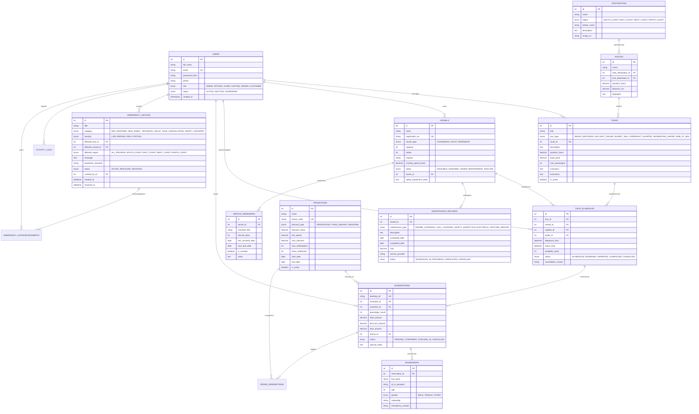

# Entity-Relationship (ER) Diagram — Boat Safari Trip Management System
**SLIIT SE2030 Software Engineering — Group Y2-S1-MLB-B8G1-09**

```mermaid
erDiagram
    USERS ||--o{ TOURS : "manages"
    USERS ||--o{ VESSELS : "owns"
    USERS ||--o{ TOUR_SCHEDULES : "captains/guides"
    USERS ||--o{ RESERVATIONS : "books"
    USERS ||--o{ EMERGENCY_NOTICES : "creates"
    USERS ||--o{ ACTIVITY_LOGS : "triggers"

    DESTINATIONS ||--o{ ROUTES : "start/end port"
    ROUTES ||--o{ TOURS : "defines"
    TOURS ||--o{ TOUR_SCHEDULES : "scheduled into"
    VESSELS ||--o{ TOUR_SCHEDULES : "assigned to"
    VESSELS ||--o{ MAINTENANCE_RECORDS : "undergoes"
    VESSELS ||--o{ SERVICE_REMINDERS : "tracked by"

    TOUR_SCHEDULES ||--o{ RESERVATIONS : "reserved by"
    RESERVATIONS ||--o{ PASSENGERS : "manifest for"
    PROMOTIONS ||--o{ RESERVATIONS : "discount on"
    PROMOTIONS ||--o{ PROMO_REDEMPTIONS : "recorded in"
    RESERVATIONS ||--o{ PROMO_REDEMPTIONS : "applies"

    EMERGENCY_NOTICES ||--o{ EMERGENCY_ACKNOWLEDGMENTS : "acknowledged in"
    USERS ||--o{ EMERGENCY_ACKNOWLEDGMENTS : "signs"

    USERS {
        int id PK
        string full_name
        string email UK
        string password_hash
        string phone
        enum role "ADMIN, OFFICER, GUIDE, CAPTAIN, OWNER, CUSTOMER"
        enum status "ACTIVE, INACTIVE, SUSPENDED"
        timestamp created_at
    }

    DESTINATIONS {
        int id PK
        string name
        enum region "SOUTH_COAST, EAST_COAST, WEST_COAST, NORTH_COAST"
        string harbor_name
        text description
        string image_url
    }

    ROUTES {
        int id PK
        string name
        int start_destination_id FK
        int end_destination_id FK
        decimal duration_hours
        decimal distance_nm
        text highlights
    }

    TOURS {
        int id PK
        string title
        enum tour_type "WHALE_WATCHING, DAYLIGHT_CRUISE, SUNSET_SAIL, OVERNIGHT_CHARTER, SNORKELING_SAFARI, DINE_AT_SEA"
        int route_id FK
        text description
        decimal duration_hours
        decimal base_price
        int max_passengers
        text inclusions
        text exclusions
        boolean is_active
    }

    VESSELS {
        int id PK
        string name
        string registration_no UK
        enum vessel_type "CATAMARAN, YACHT, SPEEDBOAT"
        int capacity
        int cabins
        string engines
        decimal cruising_speed_knots
        enum status "AVAILABLE, ASSIGNED, UNDER_MAINTENANCE, INACTIVE"
        int owner_id FK
        text safety_equipment_notes
    }

    TOUR_SCHEDULES {
        int id PK
        int tour_id FK
        int vessel_id FK
        int captain_id FK
        int guide_id FK
        datetime departure_time
        datetime return_time
        int available_seats
        enum status "SCHEDULED, BOARDING, DEPARTED, COMPLETED, CANCELLED"
        string cancellation_reason
    }

    RESERVATIONS {
        int id PK
        string booking_ref UK
        int schedule_id FK
        int customer_id FK
        int passenger_count
        decimal total_amount
        decimal discount_amount
        decimal final_amount
        int promo_id FK
        enum status "PENDING, CONFIRMED, CHECKED_IN, CANCELLED"
        text special_notes
    }

    PASSENGERS {
        int id PK
        int reservation_id FK
        string full_name
        string id_or_passport
        int age
        enum gender "MALE, FEMALE, OTHER"
        string nationality
        string emergency_contact
    }

    PROMOTIONS {
        int id PK
        string name
        string promo_code UK
        enum discount_type "PERCENTAGE, FIXED_AMOUNT, SEASONAL"
        decimal discount_value
        decimal min_spend
        decimal max_discount
        int max_redemptions
        int times_redeemed
        date start_date
        date end_date
        boolean is_active
    }

    MAINTENANCE_RECORDS {
        int id PK
        int vessel_id FK
        enum maintenance_type "ENGINE_OVERHAUL, HULL_CLEANING, SAFETY_INSPECTION, ELECTRICAL, ROUTINE_SERVICE"
        text description
        date scheduled_date
        date completed_date
        decimal cost
        string service_provider
        enum status "SCHEDULED, IN_PROGRESS, COMPLETED, CANCELLED"
    }

    SERVICE_REMINDERS {
        int id PK
        int vessel_id FK
        string reminder_title
        int interval_days
        date last_serviced_date
        date next_due_date
        boolean is_overdue
        text notes
    }

    EMERGENCY_NOTICES {
        int id PK
        string title
        enum category "BAD_WEATHER, HIGH_SWELL, TECHNICAL_DELAY, TOUR_CANCELLATION, SAFETY_ADVISORY"
        enum severity "LOW, MEDIUM, HIGH, CRITICAL"
        int affected_tour_id FK
        int affected_vessel_id FK
        enum affected_region "ALL_REGIONS, SOUTH_COAST, EAST_COAST, WEST_COAST, NORTH_COAST"
        text message
        string broadcast_channels
        enum status "ACTIVE, RESOLVED, ARCHIVED"
        int created_by_id FK
        datetime created_at
        datetime resolved_at
    }
```
